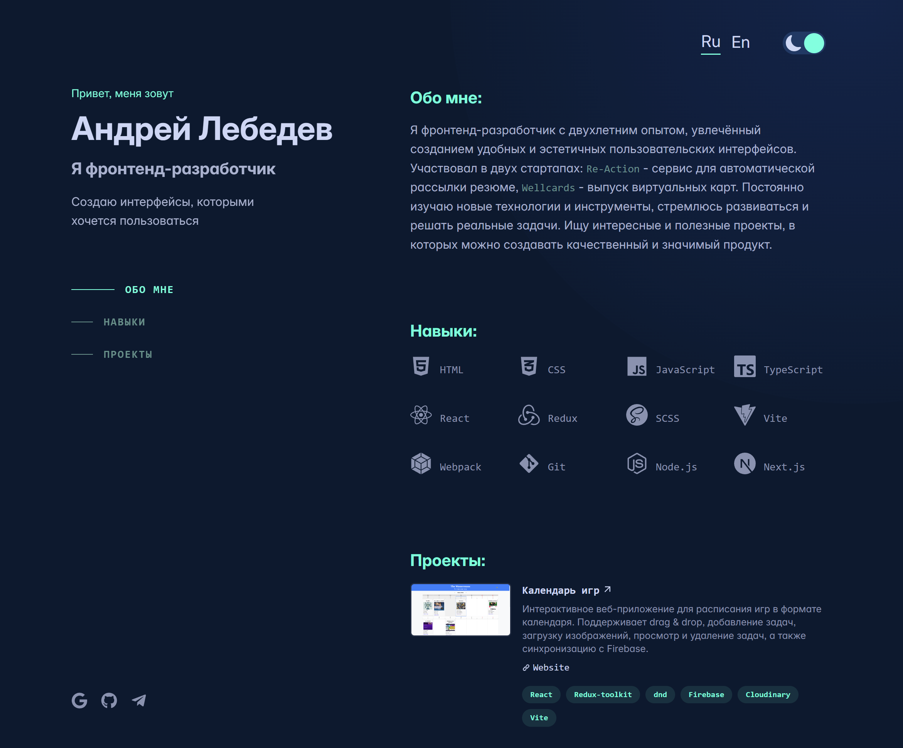

# 💼 Personal Portfolio Website

Современный одностраничный сайт-портфолио фронтенд-разработчика, созданный с нуля на **React + TypeScript**. Этот проект демонстрирует мои навыки в создании адаптивных интерфейсов, архитектуре компонентов, управлении состоянием и пользовательском UI/UX.


---

## 🔍 Особенности

- ⚛️ React 19+, TypeScript, Vite
- 🎨 SCSS-модули и CSS-переменные
- 🌗 Переключение темы (светлая / тёмная) через Redux
- 🌍 Поддержка мультиязычности (i18n-ready)
- 🧭 Фиксированная левая колонка с навигацией и соцсетями
- ✨ Эффект свечения вокруг курсора
- 📱 Полностью адаптивный дизайн

---

## 🛠️ Стек технологий

| Категория       | Технологии                            |
|-----------------|----------------------------------------|
| Язык            | TypeScript                            |
| Фреймворк       | React 19+                              |
| Сборка          | Vite                                  |
| Стилизация      | SCSS-модули, CSS variables             |
| Состояние       | Redux Toolkit                         |
| Локализация     | i18next                               |

---

## 🧱 Архитектура

- Разделение UI, логики и состояния
- Использование кастомных хуков и переиспользуемых компонентов
- Изоляция тем и языков

---

## 🚀 Установка и запуск

```bash
git clone https://github.com/yourusername/portfolio-site.git
cd portfolio-site
yarn install
yarn dev
```
Сайт будет доступен по адресу: http://localhost:5173

